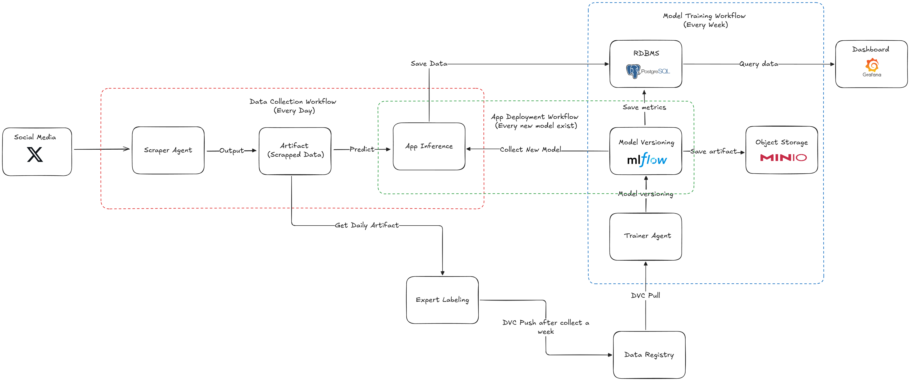

# MBG Sentiment Analysis MLOPS

This repository contains the code and resources for the MBG Sentiment Analysis MLOPS project. The project focuses on building, deploying, and maintaining machine learning models for sentiment analysis using MLOPS best practices.

## System Design

## Technologies

- Python
- FastAPI
- Docker
- MLflow
- GitHub Actions
- PostgreSQL
- Minio
- Grafana
- Nginx
- DVC

## Model

The sentiment analysis model is built using a combination of natural language processing (NLP) techniques and machine learning algorithms. The model is trained on a labeled dataset of text samples with corresponding sentiment labels (positive, negative, neutral). The model use pretrained transformer models for feature extraction and fine-tunes them for sentiment classification indobert-tweet.
